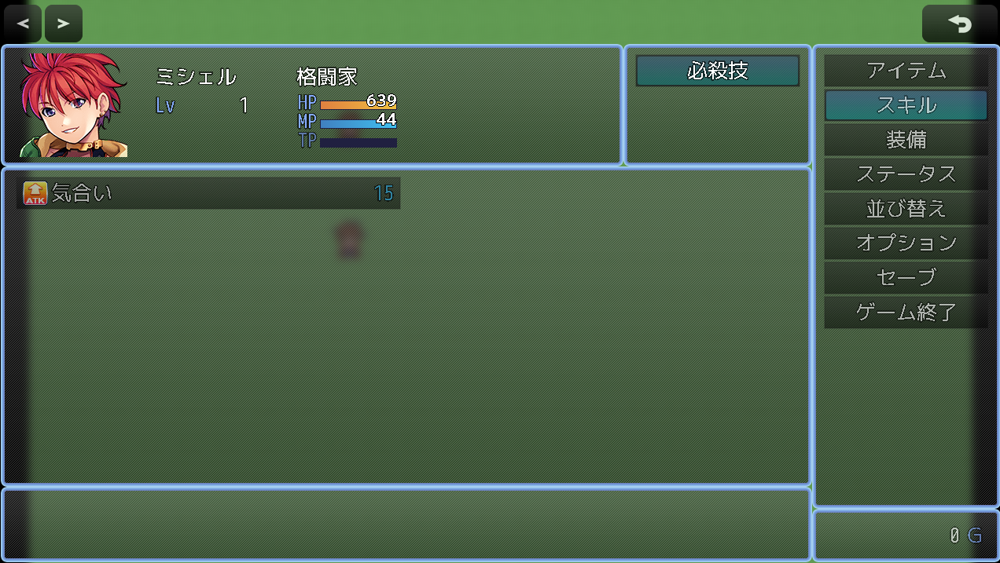

# MenuScenesResize - メニューシーン画面サイズ調整統合プラグイン

RPG Maker MZ用のプラグインで、メニューシーンに統一されたメニューバーを表示し、画面レイアウトを調整します。


## DL リンク

[ダウンロード先](https://raw.githubusercontent.com/fishs075/MZ/refs/heads/main/MenuScenesResize.js)





こちらは標準のメニューバーを左右に変更できるプラグインです。アクター表示も縦長配列になります

[ダウンロード先](https://raw.githubusercontent.com/fishs075/MZ/refs/heads/main/SideMenuScreen.js)


## 📋 機能概要

このプラグインは、以下のメニューシーンに統一されたメニューバーを表示し、より直感的なUI体験を提供します：

- **アイテムシーン** - アイテムの使用・確認
- **スキルシーン** - スキルの使用・確認  
- **装備シーン** - 装備の変更・確認
- **ステータスシーン** - キャラクターステータスの確認
- **セーブシーン** - ゲームのセーブ

以下のコマンドについては未搭載です

- **並び替えシーン** - 画面が切り替わらないため未搭載
- **オプションシーン** - 中央表示のため未搭載
- **終了シーン** - 中央表示のため未搭載

## ✨ 主な特徴

### 🎯 統一されたUI体験
- 全メニューシーンで一貫したメニューバー表示
- 現在のシーンをハイライト表示
- ゴールドウィンドウも統一されたデザイン

### ⚙️ 柔軟な設定オプション
- **メニューバー幅**: 100-400ピクセルで調整可能（デフォルト：240px）
- **メニューバー位置**: 左側または右側を選択
- **透明度設定**: 0-255で細かく調整可能（デフォルト：160）
- **背景表示**: メニューバー背景の表示/非表示切り替え

### 🔧 個別制御機能
- 各シーンを個別に有効/無効に設定可能
- 必要なシーンだけを選択して使用
- 他のプラグインとの競合を最小限に抑制

## 🚀 インストール方法

1. `MenuScenesResize.js` をダウンロード
2. プロジェクトの `js/plugins/` フォルダに配置
3. プラグイン管理画面でプラグインを有効化
4. 必要に応じてパラメータを調整

## 📖 使用方法

### 基本設定

プラグインを有効化すると、デフォルトで全てのシーンが有効になります。

### パラメータ設定

| パラメータ名 | 説明 | デフォルト値 |
|-------------|------|-------------|
| アイテムシーン有効 | アイテムシーンでメニューバーを表示 | true |
| スキルシーン有効 | スキルシーンでメニューバーを表示 | true |
| 装備シーン有効 | 装備シーンでメニューバーを表示 | true |
| ステータスシーン有効 | ステータスシーンでメニューバーを表示 | true |
| セーブシーン有効 | セーブシーンでメニューバーを表示 | true |
| メニューバー幅 | メニューバーの幅（100-400px） | 240 |
| メニューバー位置 | Left（左側）/ Right（右側） | Left |
| メニューバー背景表示 | 背景の表示/非表示 | true |
| メニューバー透明度 | 透明度（0-255） | 160 |

### カスタマイズ例

#### 右側配置・高透明度設定
```
メニューバー位置: Right
メニューバー透明度: 100
```

#### 最小構成（アイテムとセーブのみ）
```
アイテムシーン有効: true
スキルシーン有効: false
装備シーン有効: false
ステータスシーン有効: false
セーブシーン有効: true
```

## 🔧 技術仕様

### 対応バージョン
- **RPG Maker MZ**: 1.0.0以降

### 動作原理
- 各シーンの`create`メソッドを拡張してメニューバーを追加
- ウィンドウ矩形メソッドをオーバーライドしてレイアウト調整
- 条件分岐により対象シーンのみに機能を適用

### パフォーマンス
- 軽量設計で動作への影響を最小限に抑制
- 共通メソッドによりコードの重複を削減
- 必要なシーンのみ処理を実行

## 🤝 互換性

### 他プラグインとの互換性
- 標準的なメソッド拡張を使用し、競合を最小限に抑制
- Scene_ItemBase系プラグインとの共存に配慮
- 条件分岐により影響範囲を限定

### 既知の制限事項
- Scene_Loadには対応していません（セーブシーンのみ）
- カスタムメニューシステムを大幅に変更するプラグインとは競合する可能性があります

## 📝 更新履歴

### v1.0.0 (2025-08-22)
- 初回リリース
- アイテム、スキル、装備、ステータス、セーブシーンに対応
- 個別制御機能の実装
- 柔軟なパラメータ設定の実装

## 📄 ライセンス

このプラグインは無料で使用できます。

- ✅ 商用・非商用問わず自由に使用可能
- ✅ 改変・再配布可能
- ✅ クレジット表記は任意（記載していただけると嬉しいです）

## 🐛 バグ報告・要望

バグ報告や機能要望は、以下の方法でお知らせください：

- **GitHub Issues**

## 🙏 謝辞

このプラグインの開発にあたり、RPG Maker MZコミュニティの皆様からの貴重なフィードバックをいただきました。ありがとうございます。

## 📚 関連リンク

- [RPG Maker MZ 公式サイト](https://www.rpgmakerweb.com/products/rpg-maker-mz)
- [プラグイン開発ドキュメント](https://docs.rpgmakermz.com/)

---

**⭐ このプラグインが役に立った場合は、GitHubでスターをつけていただけると嬉しいです！**
