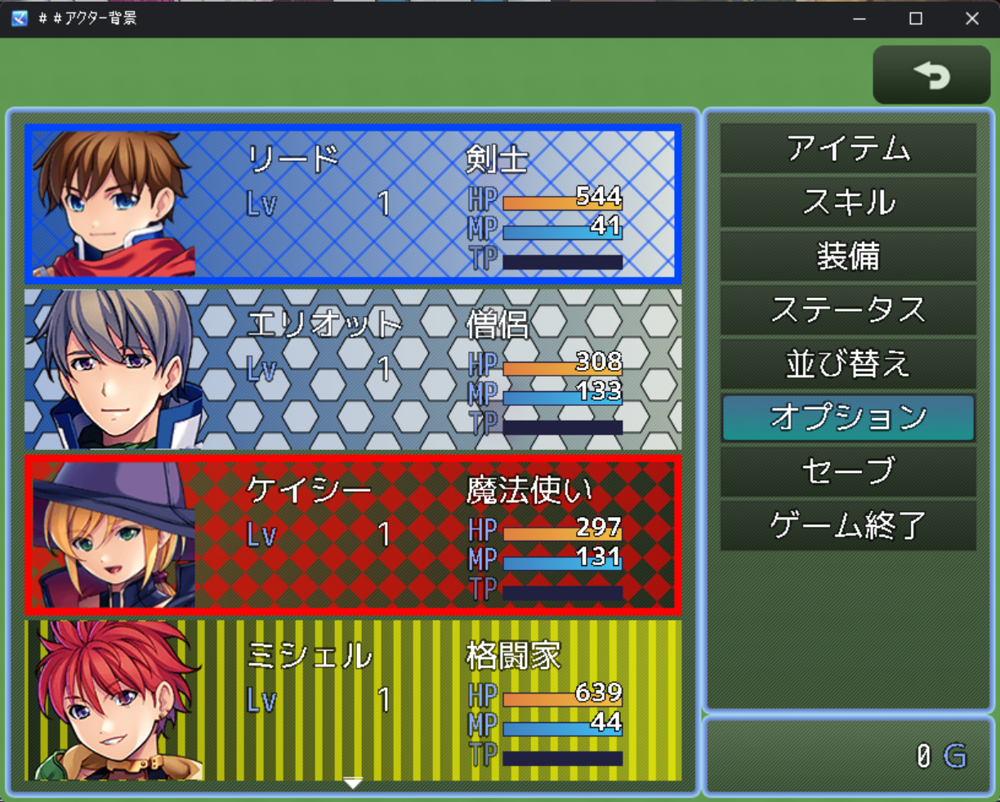
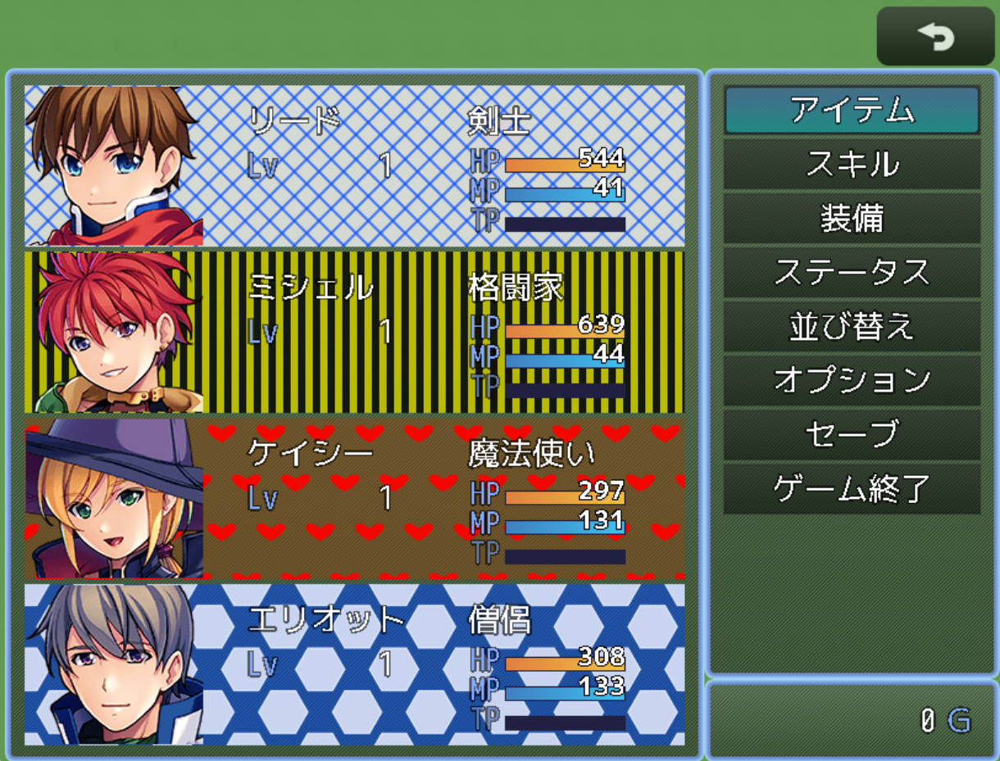
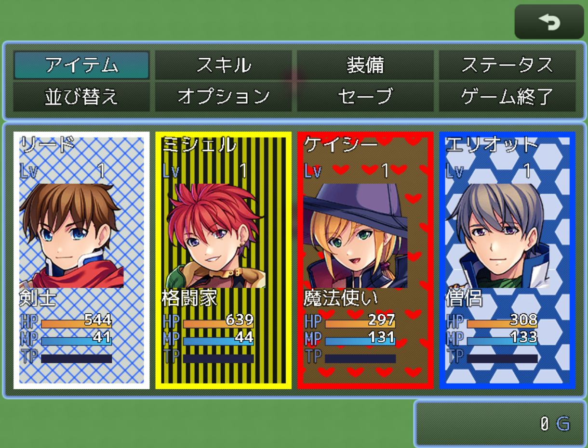

# アクターカードスタイルプラグイン

Ver2 
 
DL準備中 
 

https://github.com/user-attachments/assets/c2326919-1ac8-4b7e-af14-2ddcef50a0a4

### 特徴
-   背景のグラデーション表示
-   パターンサイズの可変
-   枠線設定時、顔画像の縮小描写

### 概要:
-   外部CSSなし、内部パターンのみでアクター背景を描画
-   プリセット色/カスタム色（#rrggbb, #rgb, 色名）＋Alphaに対応
-   背景色・パターン色・枠線色・フィルター色をアクター単位で設定
-   控えメンバーを暗く表示、グラデーション（線形/放射）対応
-   枠を使う場合、枠太さに合わせて顔グラを自動縮小・中央配置（他の顔描画には影響なし）
-   パターンタイルサイズは全体設定とアクター個別設定の両方に対応

パターン:
-   縦線/縦線(太)/横線/横線(太)/格子/斜め格子/ダイヤ/市松/水玉/ジグザグ/千鳥格子/ハニカム/ハニカム(塗)/ハート/ビューティフルドット

グラデーション:
-   線形: 角度 0=左→右, 90=上→下, 180=右→左, 270=下→上
-   放射: 中心座標(0–1)と半径で制御
-   開始/終了色はプリセット or カスタムから選択、オフセット(0–1)指定可

透過・色について:
-   デフォルト背景Alphaは0.5（プリセット色利用時）。透けが気になる場合はカスタムカラーでAlphaを高めに設定してください。
-   パターン/枠/フィルターは各自の設定Alphaを使用します。

枠と顔グラ:
-   枠表示ON時のみ、枠太さぶん内側に縮小した顔ビットマップを使用（アスペクト比維持、最小50%）
-   枠OFFや他のシーンの顔描画には影響しません。

タイルサイズ:
-   全体: PatternTileSize（16/24/32/40/48）
-   アクター個別: PatternTileSize（0=全体デフォルトを使用）

 
 
 
Ver1 

[最新版をダウンロード](https://raw.githubusercontent.com/fishs075/MZ/refs/heads/main/SKM_ActorCardStyle.js)

<!-- ここに画像を入れる予定 -->

## 概要

-   アクターのメニュー表示を CSS でカスタマイズするプラグインです。
-   背景色とパターンを組み合わせて、キャラクターごとに個性的なカードスタイルを作成できます。

## 更新履歴
- 1.0.3 - 2025/02/25
  - フィルターを枠線に適用するかどうかを選択できるオプションを追加
  - アクターIDの取得方法を改善
  - 控えメンバーの判定処理を修正
-   1.0.2 - 2025/02/23
    -   控えメンバーの背景を暗く表示する機能を追加
    -   控えメンバーの暗さをパラメータで設定可能に
-   1.0.1 - 2025/02/18
    -   カード枠機能を追加
    -   フィルター機能を追加
    -   選択エフェクトを改善
    -   パターンの追加と改善
-   1.0.0 - 2025/02/17
    -   初回リリース

## 背景色の設定

-   プリセットカラーから選択（11 色）
-   カスタムカラーで RGB 指定
-   濃さの調整（薄い/普通/濃い）

## 背景パターン

-   直線系:

    -   縦線/縦線（太）
    -   横線/横線（太）
    -   格子
    -   斜め格子

-   幾何学模様:

    -   市松模様
    -   水玉
    -   ジグザグ
    -   千鳥格子

-   装飾系:
    -   ハニカム（線/塗）
    -   ハート

## カード枠機能

-   枠線の表示/非表示
-   枠色をカスタマイズ可能
-   線の太さを調整可能
-   高解像度向け機能

## フィルター機能

-   カスタムカラーによるフィルター効果
-   背景全体に色調を追加
- 枠線にフィルターを適用するかどうかを選択可能
## 控えメンバー表示

-   控えメンバーの背景を暗く表示
-   暗さの度合いを調整可能（0.0 ～ 1.0）

## 使用方法

1. プラグインパラメータでアクターごとの設定を行います
2. 背景色とパターンの組み合わせを設定
3. 必要に応じてカスタムカラーを定義
4. カード枠の有無や色を設定
5. フィルター効果の設定
6. 控えメンバーの暗さを調整

## カスタムカラーの設定

1. カラー名を設定（例：custom1）
2. RGB 値をそれぞれ 0-255 で指定
3. 濃さを 0-1.0 で指定

## 選択エフェクト

-   通常選択、アイテム選択、全体選択時に統一された視覚効果
-   白色グラデーションによる強調表示
-   高い視認性と操作感の向上

## 注意事項

-   カスタムカラーは背景色、パターン色、カード枠、フィルターで使用可能
-   カード枠は高解像度環境での使用を推奨
-   カード枠は濃さを無視し不透明度 255
-   フィルターは最大濃さでも透けてかかる

## 利用規約

-   クレジット表記は不要です
-   商用利用可
-   改変可
-   素材単体の再配布禁止

## 注意事項

-   素材利用は自己責任でお願いします
-   競合する可能性のあるプラグインとの併用は十分テストしてください
-   特にメニューのスタイルを変更するプラグインとは組み合わせると正常に動かない可能性があります

## サポート

不具合や要望がありましたら、GitHub の Issues にてご報告ください。 
ツクールフォーラムの公開スレッドでも対応しております

## 作者

さかなのまえあし
