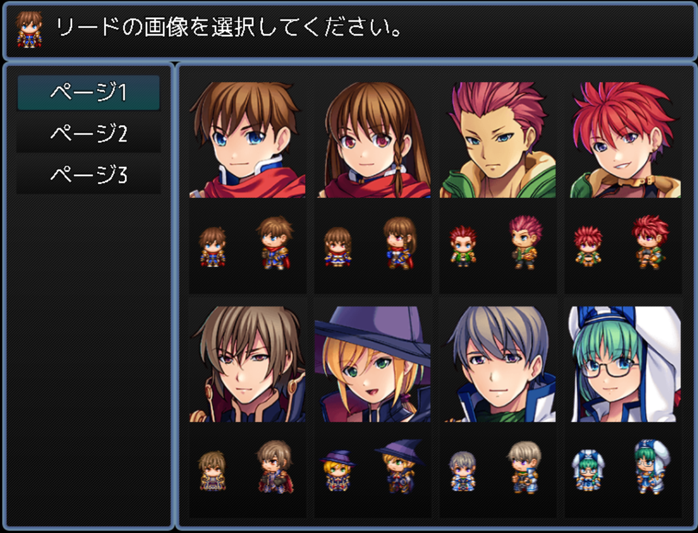

# アクター画像変更システム (RPG Maker MZ)

[最新版 DL](https://raw.githubusercontent.com/fishs075/MZ/refs/heads/main/SKM_ChangeActorImageSystem.js)

※告知 
現在、プラグインコマンドで変数を使用するをonにしていると２回目以降うまく切り替えられないバグを発見しております。 
修正まで変数を使用した切り替え方法は使用しないようしばらくお待ち願います

## 概要

RPG ツクール MZ 用のプラグインで、ゲーム中にアクターの画像（顔画像、歩行キャラ、戦闘キャラ）を変更することができます。

## 特徴

-   複数の画像セットをページ分けして表示
-   顔画像のみの変更モードをサポート
-   プラグインコマンドによる直接変更機能
-   画像の事前読み込み機能でスムーズな表示
-   カスタマイズ可能なウィンドウ設定

## 使用方法

プラグインコマンドから、パラメータを指定して使用します。

#### アクター画像変更

アクター画像変更画面を表示し、その中から選択して容姿を変更します。 
パラメータ：

-   読み込む画像数：使用する画像数（1 始まり）
-   アクター ID：変更するアクターの ID
-   ファイル名：読み込む画像ファイルの基本名（省略時はパラメータ設定値を使用）
-   1 ページの画像数：1 ページに表示する画像数（省略時はパラメータ設定値を使用、最大 8）

#### アクター画像直接変更

ウィンドウを表示せずに直接画像を変更します。 
パラメータ：

-   アクター ID：変更するアクターの ID
-   ページ番号：使用するページ番号（1 始まり）
-   インデックス：画像のインデックス（1 ～ 8）
-   ファイル名：使用するファイル名（省略可）
-   顔画像のみ変更：顔画像のみを変更するかどうか（省略可）

#### 画像事前読み込み

画像を事前に読み込みます。 

## 注意事項

-   必要な画像ファイルを事前に用意してください
-   画像が存在しない場合はエラーで停止します
-   フェイス画像とキャラチップは必須です
-   SV アクター使用時は対応する SV アクター画像も必要です
-   顔画像のみ変更のときは、キャラチップも不要です

### 基本設定

1. プラグインをプロジェクトに導入
2. プラグインパラメータで基本設定を行う
3. 必要な画像ファイルを準備

### 画像ファイルの準備

必要な画像ファイル（例：基本ファイル名が"Actor"の場合）：

1. フェイス画像とキャラチップ

    - Actor1.png, Actor2.png, Actor3.png...（読み込む画像数分必要）
    - img/faces/と img/characters/に配置

2. SV アクター画像（SV アクター使用時のみ）
    - Actor1_1.png, Actor1_2.png ... Actor1_8.png
    - Actor2_1.png, Actor2_2.png ... Actor2_8.png
    - img/sv_actors/に配置

### 開発履歴

v1.3.1 2025/02/14 - アクター ID の変数指定を復活。 
v1.3.0 2025/02/09 - リファクタリング後、元の動作を再現するまで修正。機能追加。 

v1.2.0-1.2.7 (2023/5/24-10/2) - Sakananomaeasi による MZ 移植と改修

-   RPG ツクール MZ への移植
-   画像の先読み機能搭載
-   ウインドウサイズ設定の修正
-   顔画像サイズの調整機能追加
-   その他バグ修正

v1.1.0-1.1.2 (2020/3/10-12) - Utsuda 氏による改修

-   キャンセルコマンドの追加
-   タッチ入力時のキャンセル挙動修正

v1.0.0-1.0.2 (2017/5/16-17) - Tsumio 氏による初期開発

-   基本機能の実装
-   背景色指定機能の追加
-   1 ページ表示数設定機能の追加

## ライセンス

MIT License 
作者に無断で改変、再配布が可能で、利用形態についても制限はありません。 
自由に使用してください。

## 作者

さかなのまえあし
