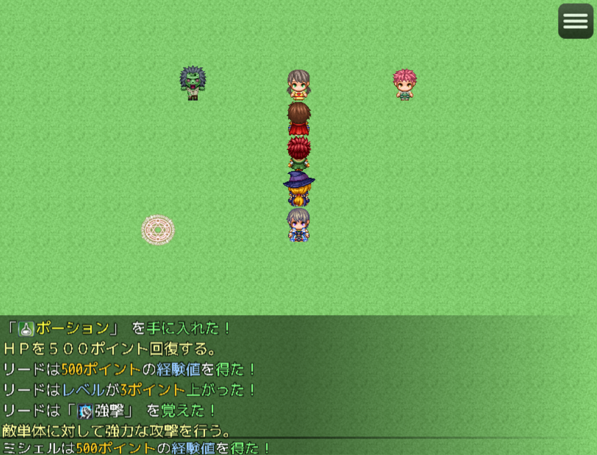

# ポップアップ表示プラグイン

[最新版をダウンロード](https://raw.githubusercontent.com/fishs075/MZ/refs/heads/main/SKM_GetInformation.js)

<!-- ここに画像を入れる予定 -->

## 概要
RPGツクールMZ用の汎用ポップアップ表示プラグインです。アイテム入手や経験値獲得、レベルアップなどの際にポップアップ通知を表示する機能を提供します。

## 特徴
- アイテム、経験値、ゴールド、レベルアップなどの獲得/消失時にポップアップ表示
- カスタマイズ可能な表示スタイルと演出
- 戦闘中/マップ上での表示に対応
- ログ機能搭載
- 多彩なアニメーションパターン

## 使用方法
1. プラグインをプロジェクトに導入するだけで基本機能が有効になります
2. プラグインパラメータで詳細な設定が可能です

## 主な設定項目
- 表示パターン（にょき/普通/うにょーん）
- 文字サイズ
- 表示時間
- 表示位置
- 各種メッセージテキスト
- ログ機能の設定

##使用できるタグ
 - ■テキストの色変更
 - アイテムのメモ欄に
 - `<NameColor:色番号>`でアイテムの名前の色を変更することができます。

## ライセンス
MITライセンス

## 作者
- 原作: Yana
- MZ移植: さかなのまえあし

## 更新履歴
- ver1.0.0 (2025/02/15) 移植してあったものを統合、リファクタリング。プラグイン連携のわからない項目を一時停止。

## 利用規約

-   クレジット表記は不要です
-   商用利用可
-   改変可
-   素材単体の再配布禁止

## 動作要件
RPGツクールMZ

## 注意事項
- 素材利用は自己責任でお願いします
- 競合する可能性のあるプラグインとの併用は十分テストしてください

## サポート

不具合や要望がありましたら、GitHub の Issues にてご報告ください。 
ツクールフォーラムの公開スレッドでも対応しております

## 作者

さかなのまえあし