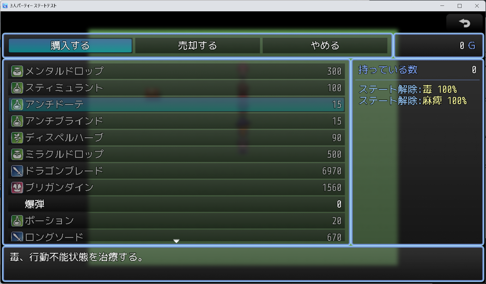
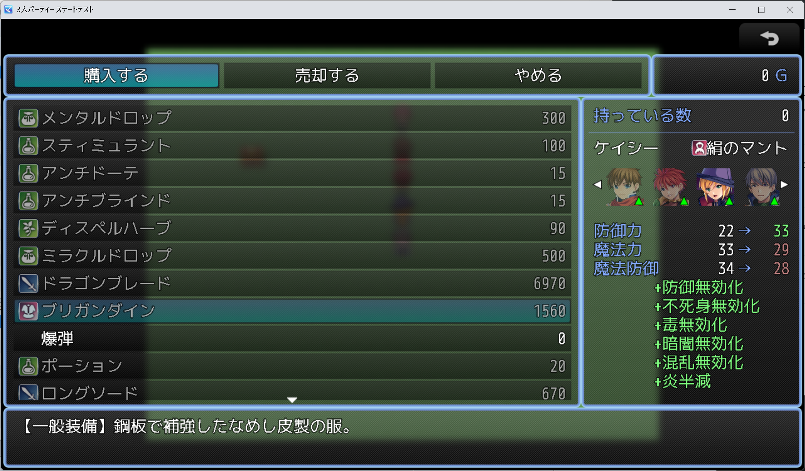
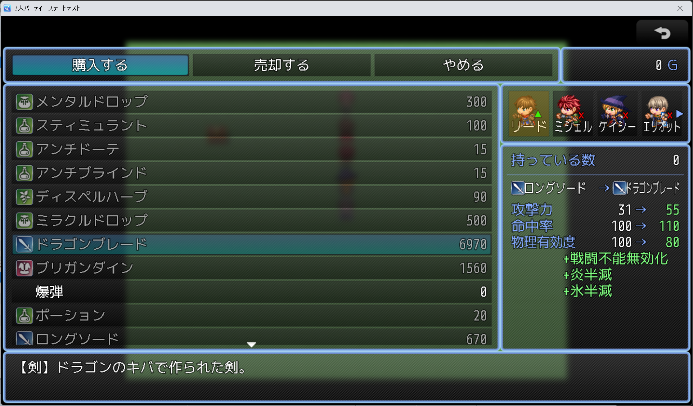
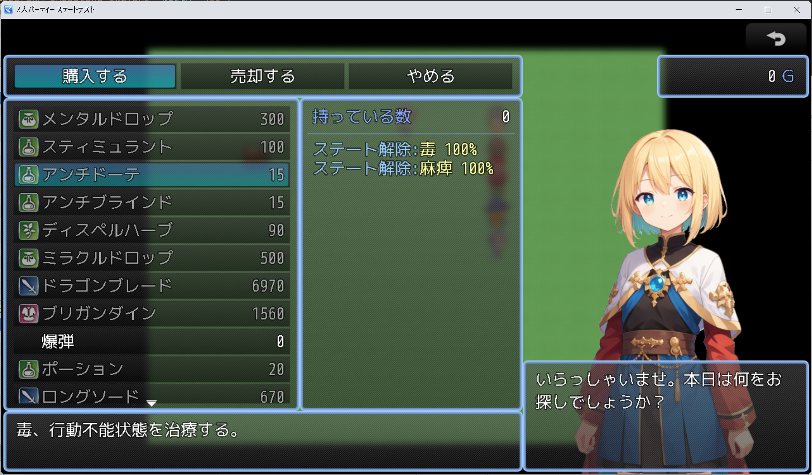
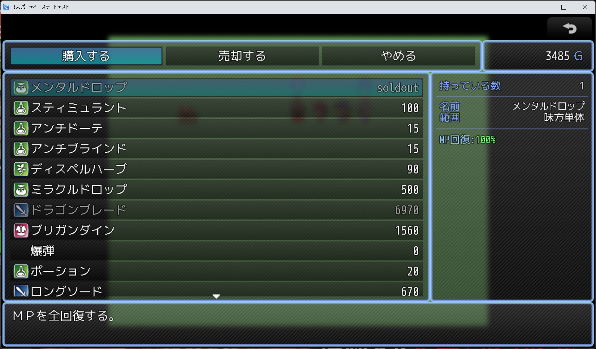

# ショップシーン拡張 (SKM_ShopScene_Ex.js)

このプラグインは 
うなぎおおとろさんのショップ画面拡張 ShopScene_Extension.js 
https://raw.githubusercontent.com/unagiootoro/RPGMZ/master/ShopScene_Extension.js 
Yanaさんのミニインフォメーションウィンドウ MiniInformationWindow.js 
 
木星ペンギンさんの装備ステータスの表示内容を変更 MPP_EquipStatusEX.js およびショップ対応 MPP_EquipStatusEX_Op1.js 
http://woodpenguin.blog.fc2.com/ 

これらを組み合わせて独自要素を追加したショップ画面拡張プラグインです 
 

■ [DLリンク](https://raw.githubusercontent.com/fishs075/MZ/refs/heads/main/SKM_ShopScene_Ex.js)

 

### 主な特徴
#### 詳細な装備比較
 - 変化するパラメータのみを色分け表示
 - 差分／2列表示などレイアウト切替
 - ステータス表示ルールを細かく指定可能

#### アイテム情報ウィンドウ
 - 命中タイプ／使用可能時／範囲など任意の情報項目をリスト化
 - アイテム効果（回復やステート付与）を色付きで見やすく表示

#### アクター表示の自由度
 - キャラチップ・縦長チップ・顔グラの切替
 - アクター切り替え矢印／タッチ操作に対応
 - 装備可否や性能アップをアイコン・三角で可視化

#### 柔軟なレイアウト＆用語設定
 - ウィンドウ幅／フォントサイズ／用語辞書をプラグインパラメータで一括管理

#### こんな時に
 - 装備比較をもっと分かりやすく、かっこよく演出したい
 - ショップでアイテム説明やイベント感のある演出を行いたい

 

## オプション１（SKM_ShopPartySelect.js）

ショップ画面のステータス上部に、パーティ人数分の簡易アイコン（顔/歩行/SV）を 
横並びで表示する選択ウィンドウを追加します。クリック/タップで 
ステータス表示対象のアクターを切り替えできます。 
 
また、購入/売却をまだ選んでいないコマンド選択中は、 
パーティ選択ウィンドウの下に幅を合わせた空のウィンドウを表示します。 
売却モード中は、パーティ選択ウィンドウを自動で非表示にします。 
 
プラグインコマンドはありません。 
 
単体でも装備品にシンボルを表示するようにしました 
 

■ [DLリンク](https://raw.githubusercontent.com/fishs075/MZ/refs/heads/main/SKM_ShopPartySelect.js)

## オプション２（SKM_ShopWindowClamp.js）

プラグインコマンドで「次に実行するショップの処理」だけ、 
ゴールドウィンドウ以外の各ウィンドウを指定した横幅に収めます。 
プラグインコマンドを実行しなかった場合は従来どおりの幅で表示されます。 
また、開けた部分にピクチャやテキストメッセージを表示することもできます 
また店内で起こしたアクション（入店/退店/購入など）に対してテキストやイラストを変化させることができます 
 
■ 2025/12/02 プラグインパラメーターを整理しましたので今までのものから入れ替える場合は注意をお願いします 

https://github.com/user-attachments/assets/97bee934-857a-4fec-93a0-4afec0801234

■ [DLリンク](https://raw.githubusercontent.com/fishs075/MZ/refs/heads/main/SKM_ShopWindowClamp.js)

## オプション３（SKM_SoldOutFlag.js）

プラグインコマンドをショップを開く直前に実行すると、 
次に開くショップシーン限定で、メモ欄に ＜soldout＞ を含む商品を 
「購入不可＋価格欄に任意のラベル表示」に変換します。 
ショップ終了後は自動的に通常状態へ戻ります。 

■ [DLリンク](https://raw.githubusercontent.com/fishs075/MZ/refs/heads/main/SKM_SoldOutFlag.js)

## オプション４(SKM_NextRandomShop.js)

次に開くショップの
イベント内で「次のショップをランダム化」を実行すると、 
次の「ショップの処理」で販売リストから指定数だけを抽選します。 
 
さらに、以下のリセット条件を任意に組み合わせて設定できます。 
 ・累計購入額が一定を超える 
 ・戦闘回数が一定に達する 
 ・所定のゴールドを支払って手動リフレッシュ 
 
いずれも0のままなら従来通り「次のショップ1回だけ」適用されます。 
 
【基本的な流れ】 
1. 「次のショップをランダム化」で抽選数とリセット条件を設定
2. 「ショップID」を指定。指定しない場合通常のショップに影響あり。
3. 続けてイベントコマンド「ショップの処理」を実行
4. 同じ条件を満たすまで抽選内容は固定
5. 条件を満たしたら再び「次のショップをランダム化」で新しい在庫を生成

■ [DLリンク]()バグ発見によりDL中止中

## 【更新履歴】
 - 1.0.0 初版
 - 1.0.1 バグ修正
 - 1.0.2 競合しそうな関数名をリネーム
 - 1.1.0 アイテムステータス画面をカスタマイズ可能にした
 - 1.2.0 とんび様のキャラデータを参考に長身キャラチップに暫定対応
 - 1.2.1 縦72のキャラチップに対応。プラグインパラメータから設定して下さい
 - 1.2.5 アイコンを縮小表示するようにした。レイアウト調節
 - 1.3.0 リファクタリング（仮版:動作チェック後）
 - 1.4.0 プラグインパラメータの整理・リネーム
 - 1.4.1 プラグインパラメータからのリストを表示できなかった問題を修正

## 【ライセンス】
このプラグインは、元となったプラグインがMITライセンスで配布しているため 
このプラグインもMITライセンスの条件の下で利用可能とします。 
 
Copyright (c) 2023 sakananomaeasi 
Released under the MIT license 
http://opensource.org/licenses/mit-license.php 
 
Copyright (c) 2020 unagiootoro 
Released under the MIT license 
https://raw.githubusercontent.com/unagiootoro/RPGMZ/refs/heads/master/LICENSE

Copyright (c) 2016 Yana 
Released under the MIT license 
http://opensource.org/licenses/mit-license.php

Copyright (c) 2022 Mokusei Penguin 
Released under the MIT license 
https://opensource.org/licenses/mit-license.php

