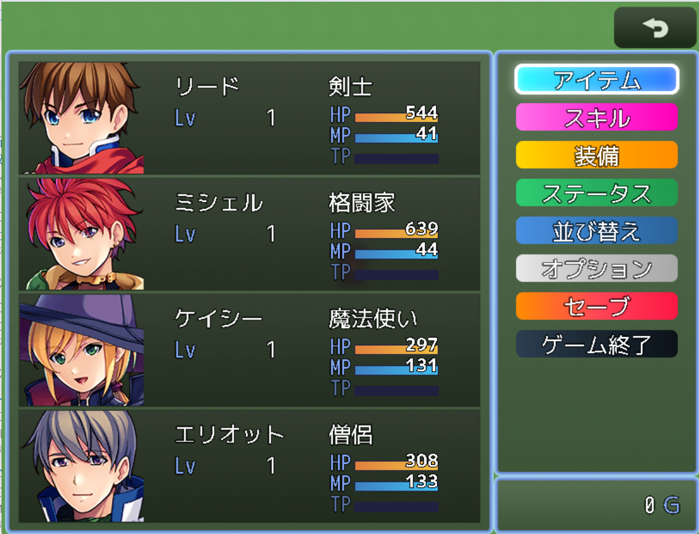
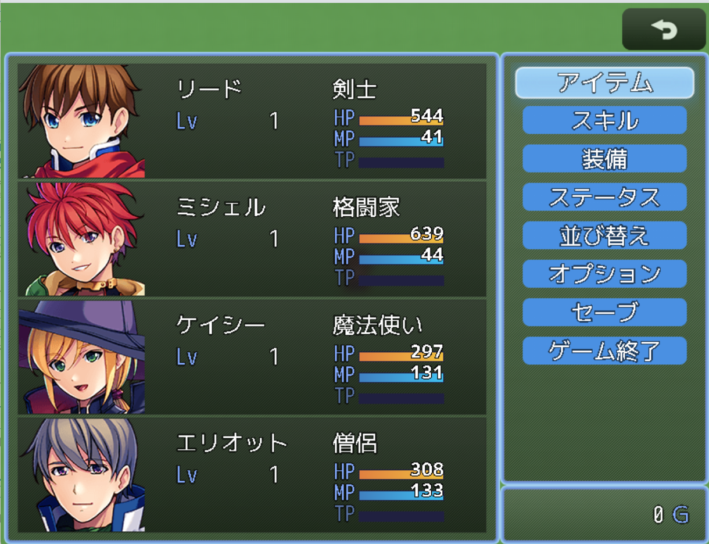
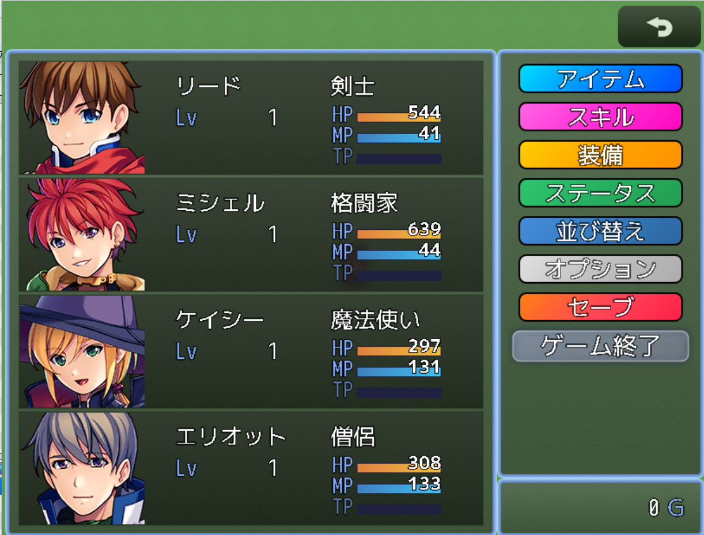

# カラフルメニューカスタマイズプラグイン
 
 
[最新版をダウンロード](https://raw.githubusercontent.com/fishs075/MZ/refs/heads/main/SKM_calfulmenu.js)

<!-- ここに画像を入れる予定 -->

#### 戦闘時のコマンドカスタマイズ版
[最新版をダウンロード](https://raw.githubusercontent.com/fishs075/MZ/refs/heads/main/SKM_calfulbattlecommand.js)

https://github.com/user-attachments/assets/147a3df8-dbf3-4e87-ac11-d30e4c9184f4

#### メニュー有効/無効スイッチコントロール
[最新版をダウンロード](https://raw.githubusercontent.com/fishs075/MZ/refs/heads/main/MenuCommandSwitchControl.js)

メニューコマンドの有効/無効をスイッチでオンオフします

## 更新履歴
#### カラフルメニュー
- v1.0.5 (2025/12/08)
  - コマンド無効時の表示を対応

- v1.0.4 (2025/03/19)
  - 他プラグインとの互換性強化
  - メニューコマンド並び替えプラグインとの併用時のフリーズ問題を修正
  - コマンド処理とアクター選択処理の改善
  - ステータスウィンドウのハンドラー設定を強化
  - シーン遷移の安定性向上

 - v1.0.3 (2025/03/17)
    - アイコン機能の追加
    - 各コマンドにアイコンを設定可能
    - アイコンの拡大率調整（0.1～2.0）
    - アイコンの位置調整（X,Yオフセット）
    - アイコンと文字の間隔調整

- v1.0.1 - v1.0.2 (2025/02/16)
  - 選択時の演出を3パターンに分離（アニメーション/発光のみ/なし）
  - 発光パターンの追加（フロー、リップル）
  - 枠線機能の追加（アニメーション追従対応）
  - コードの最適化

- v1.0.0 (2025/02/13)
  - 初版リリース
  - 基本機能の実装
  - アニメーション機能の実装

#### コマンドカスタマイズ版
 - v1.0.1 (2025/03/19)
    - バグ修正
    - アニメーションが戦闘ごとに加速していく問題に対応

## 概要

このプラグインは、RPGツクールMZのメニュー画面をよりモダンでカラフルな見た目にCSSを使ってカスタマイズします。 
各メニューコマンドに個別の色やアニメーション効果を設定でき、ゲームの雰囲気に合わせた演出が可能です。 
 
他のメニュー系プラグインと併用するときはこちらを後ろに置いたほうが安定します 
 
#### 戦闘時のコマンドカスタマイズ版 
戦闘時のパーティーメニューとアクターメニューを同じ要領でカスタマイズします 
 

## 主な機能

### 1. 豊富なプリセットカラー
- シンプルカラー（青、赤、緑）
- グラデーション（オーシャン、サンセット、フォレストなど）
- 特殊効果（ネオン、メタル）
- カスタムカラー設定も可能

### 2. アイコン機能
 - 各コマンドにアイコンを設定可能
 - アイコンの拡大率調整（0.1～2.0）
 - アイコンの位置調整（X,Yオフセット）
 - アイコンと文字の間隔調整
   - -1：デフォルト値（8ピクセル）を使用
   - 0以上：指定したピクセル値を使用

### 3. 選択時の演出パターン
#### アニメーションパターン（6種類）
- ブリーズ：ふわふわと浮遊
- バウンス：軽やかに跳ねる
- シェイク：小刻みに振動
- スライド：横方向に揺れる
- ジグザグ：ギザギザと動く
- ロータリー：回転

#### 発光パターン（4種類）
- パルス：光の波動
- スパークル：きらきらと光る
- フロー：左から右へ流れる発光
- リップル：波紋のような発光

### 4. パフォーマンス設定
- 選択時の演出切り替え
  - アニメーション：動きと光の組み合わせ
  - 発光のみ：静的な位置で光の効果
  - なし：シンプルな表示
- 静的表示モードでの選択効果
- 軽量化オプション

### 5. 枠線カスタマイズ
- 枠線の有効/無効切り替え
- 枠線の太さ調整（1-8px）
- 枠線の色設定
  - プリセット（白、黒、赤、青、黄）
  - カスタムカラー（HTMLカラーコード）
- アニメーション追従設定
  - 追従：メニュー項目の動きに合わせて枠線も動く
  - 固定：枠線は元の位置に固定

## 使用方法

1. プラグインをプロジェクトに導入
2. プラグインパラメータでカスタマイズ
   - 各コマンドの色をプリセットから選択
   - アニメーションスタイルを設定
   - 枠線の設定（オプション）

## プリセットカラー一覧
- シンプルブルー：青の単色
- シンプルレッド：赤の単色
- シンプルグリーン：緑の単色
- オーシャングラデーション：深い青のグラデーション
- サンセットグラデーション：夕暮れのような赤のグラデーション
- フォレストグラデーション：森のような緑のグラデーション
- レインボーグラデーション：虹色のグラデーション
- ネオンブルー：光る青
- ネオンピンク：光るピンク
- ゴールドメタル：金属的な金色
- シルバーメタル：金属的な銀色
- ミッドナイト：夜をイメージした暗い色
- サンライズ：朝焼けをイメージした色
- オータム：秋をイメージした色
- スプリング：春をイメージした色

## 注意事項
- 他のメニュー関連プラグインとの競合にご注意ください
- プラグインの上下関係に注意してください
- カスタムカラー設定時はHTMLカラーコードを使用します

## プラグインコマンド
このプラグインには、プラグインコマンドはありません。

## 利用規約
- クレジット表記は不要です
- 商用利用可
- 改変可
- 素材単体の再配布禁止

## サポート
不具合や要望がありましたら、GitHubのIssuesにてご報告ください。 
ツクールフォーラムの公開スレッドでも対応しております。

## 作者
さかなのまえあし 
