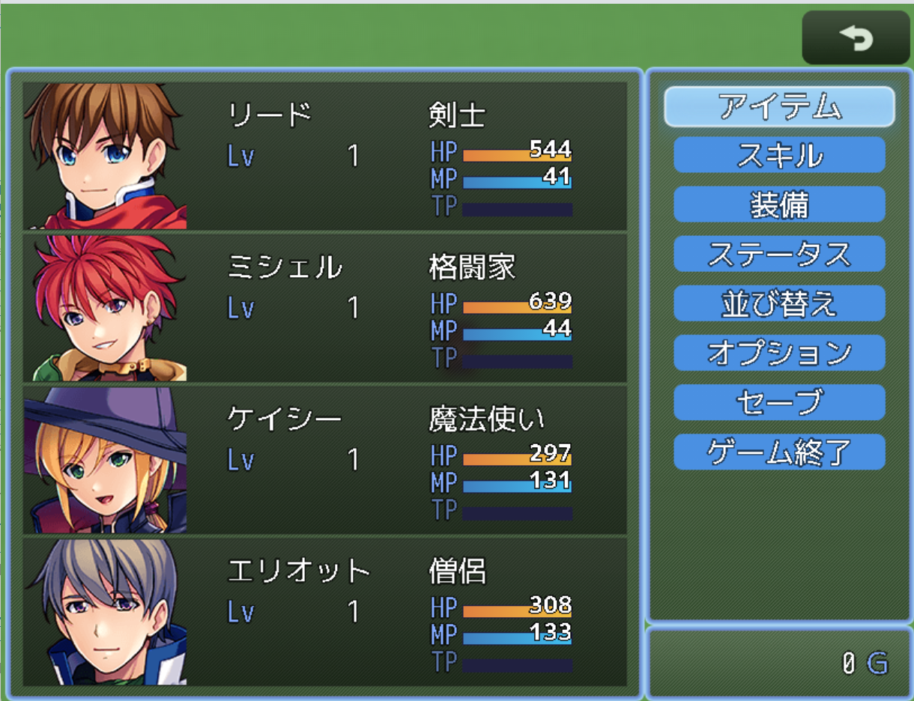

# ポップメニューカスタマイズプラグイン

[最新版をダウンロード](https://raw.githubusercontent.com/fishs075/MZ/refs/heads/main/SKM_pop_menu.js)

<!-- ここに画像を入れる予定 -->

## 更新履歴

-   v1.0.0 (2025/02/15)
    -   初版リリース
    -   基本機能の実装
    -   アニメーション機能の実装

## 概要

このプラグインは、RPG ツクール MZ のメニュー画面をよりモダンでカラフルな見た目にカスタマイズします。
各メニューコマンドに個別の色やアニメーション効果を設定でき、ゲームの雰囲気に合わせた演出が可能です。

## 主な機能

### 1. 豊富なプリセットカラー

-   シンプルカラー（青、赤、緑）
-   グラデーション（オーシャン、サンセット、フォレストなど）
-   特殊効果（ネオン、メタル）
-   カスタムカラー設定も可能

### 2. 選択時のアニメーション（8 種類）

-   ブリーズ：ふわふわと浮遊
-   パルス：光の波動
-   バウンス：軽やかに跳ねる
-   シェイク：小刻みに振動
-   スライド：横方向に揺れる
-   スパークル：きらきらと光る
-   ジグザグ：ギザギザと動く
-   ロータリー：円を描くように回転

### 3. パフォーマンス設定

-   アニメーション効果の ON/OFF 切り替え
-   静的表示モードでの選択効果

## 使用方法

1. プラグインをプロジェクトに導入
2. プラグインパラメータでカスタマイズ
    - 各コマンドの色をプリセットから選択
    - アニメーションスタイルを設定
    - アニメーション有効/無効を設定
    - カスタムカラーも設定可能

## プリセットカラー一覧

-   シンプルブルー：青の単色
-   シンプルレッド：赤の単色
-   シンプルグリーン：緑の単色
-   オーシャングラデーション：深い青のグラデーション
-   サンセットグラデーション：夕暮れのような赤のグラデーション
-   フォレストグラデーション：森のような緑のグラデーション
-   レインボーグラデーション：虹色のグラデーション
-   ネオンブルー：光る青
-   ネオンピンク：光るピンク
-   ゴールドメタル：金属的な金色
-   シルバーメタル：金属的な銀色
-   ミッドナイト：夜をイメージした暗い色
-   サンライズ：朝焼けをイメージした色
-   オータム：秋をイメージした色
-   スプリング：春をイメージした色

## 注意事項

-   他のメニュー関連プラグインとの競合にご注意ください
-   プラグインの上下関係に注意してください
-   カスタムカラー設定時は HTML カラーコードを使用します

## プラグインコマンド

このプラグインには、プラグインコマンドはありません。

## 利用規約

-   クレジット表記は不要です
-   商用利用可
-   改変可
-   素材単体の再配布禁止

## サポート

不具合や要望がありましたら、GitHub の Issues にてご報告ください。 
ツクールフォーラムの公開スレッドでも対応しております。

## 作者

さかなのまえあし
