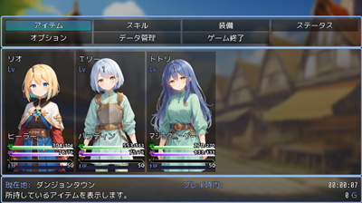
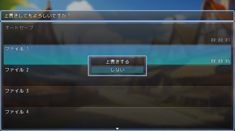

# セーブメニュー＞データ管理コマンド置き換えプラグイン

SKM_savemenuEX 
[DL リンク](https://raw.githubusercontent.com/fishs075/MZ/refs/heads/main/SKM_SavemenuEX.js)

SKM_SavemenuEX_op 
[DL リンク](https://raw.githubusercontent.com/fishs075/MZ/refs/heads/main/SKM_SavemenuEX_op.js)

## プラグイン概要

このプラグインは、RPG ツクール MZ のセーブメニューをカスタマイズし、データ管理コマンドに置き換えるためのプラグインです。ユーザーは、セーブ、ロード、データ削除のコマンドを簡単に管理できます。 
オプションプラグインは、セーブ、ロード、データ削除の各画面に確認ダイアログを追加するためのプラグインです。ユーザーが操作を行う前に確認を促すことで、誤操作を防ぎます。

## バージョン

-   1.0.0 (2025/01/19) 初版

op

-   1.0.0 (2025/01/19) 初版

## 特徴

-   メニューのセーブコマンドをデータ管理メニューに統合
-   データ削除時にカスタマイズ可能なメッセージを表示
-   効果音の設定が可能

## op 特徴

-   セーブ画面、ロード画面、データ削除画面で確認ダイアログを表示
-   各画面での確認メッセージをカスタマイズ可能
-   確認ウィンドウの透過設定が可能

## インストール方法

1. `SKM_savemenuEX.js`、`SKM_SavemenuEX_op.js`ファイルをプロジェクトの`js/plugins`フォルダにコピーします。
2. RPG ツクール MZ のプラグイン管理から「SKM_savemenuEX」「SKM_SavemenuEX_op」を有効にします。 3.オプションプラグインを使用する場合は「SKM_savemenuEX」より下に配置してください

## 使用方法

プラグインを有効にした後、メニューに新たに表示されるコマンドを使用して、セーブ、ロード、データ削除を行うことができます。 
オプションプラグインを有効にした後、セーブ、ロード、データ削除を行う際に確認ダイアログが表示されます。

## 注意事項

-   他のプラグインとの互換性については、事前にテストを行ってください。
-   プラグインの使用に関する問題やバグが発生した場合は、Issue を作成してください。

## ライセンス

このプラグインは、MIT ライセンスの下で配布されています。

## 作者

-   さかなのまえあし
