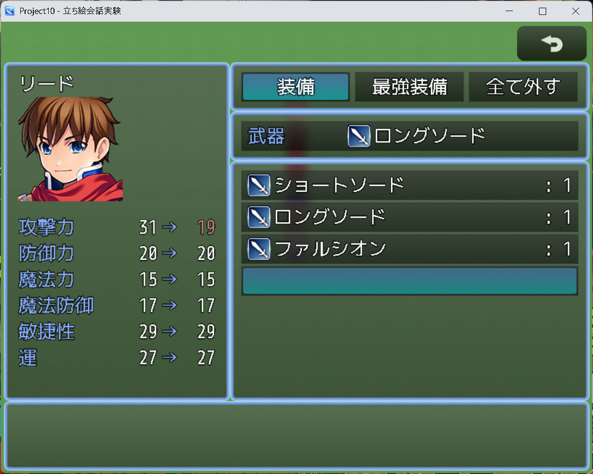
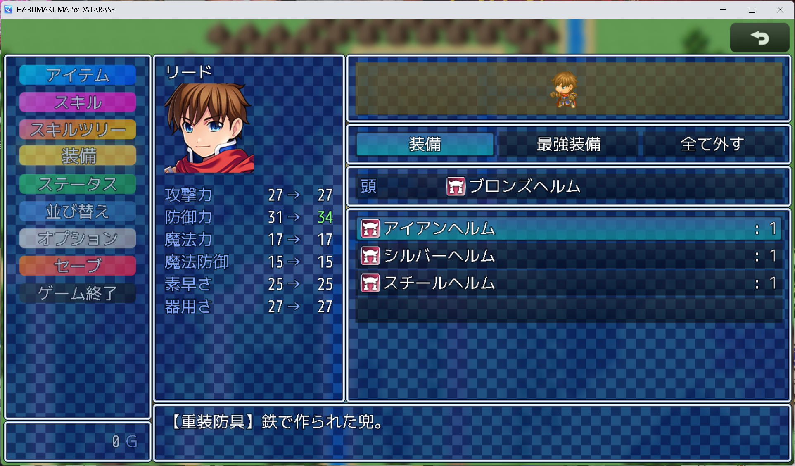

# 今何装備してるの？プラグイン（SlotInfoWindow.js）

このプラグインは、装備画面でアイテム選択ウィンドウが表示されている間、 
選択中の装備部位と現在装備しているアイテムを別ウィンドウで表示します。 
プラグインを導入して有効化するだけで動作します。 
 

■ [DLリンク](https://raw.githubusercontent.com/fishs075/MZ/refs/heads/main/SlotInfoWindow.js)

## 【ライセンス】
このプラグインはMITライセンスの条件の下で利用可能とします。 
 
Copyright (c) 2025 sakananomaeasi 
Released under the MIT license 
http://opensource.org/licenses/mit-license.php 

